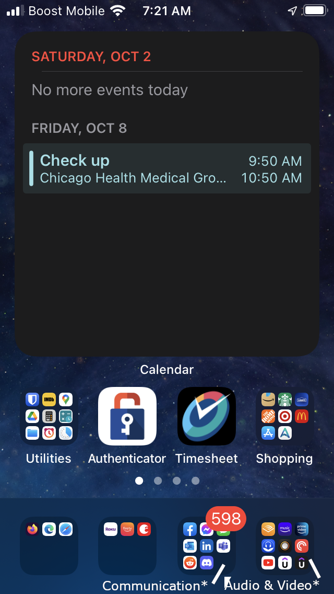
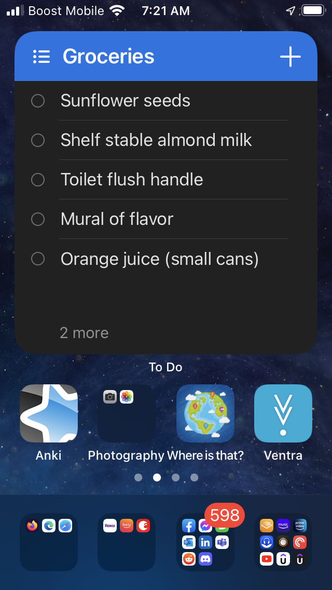
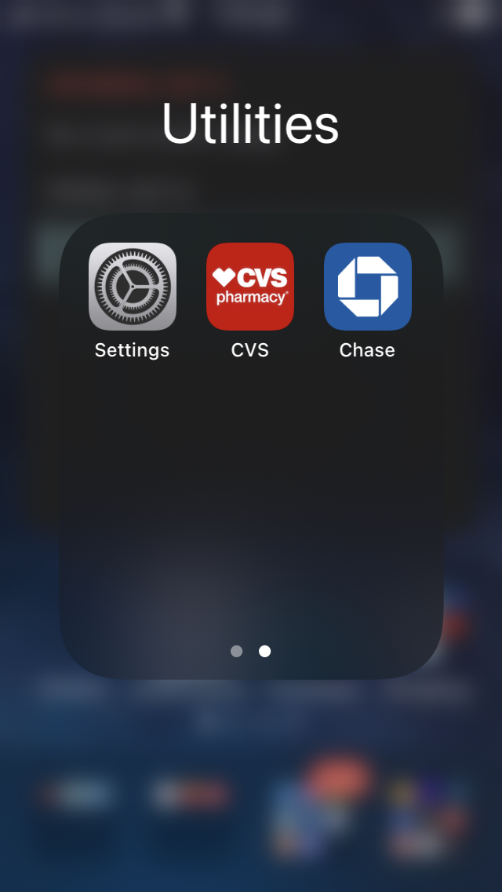
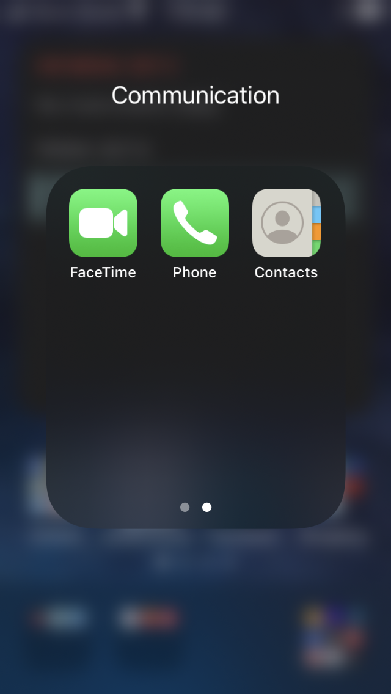
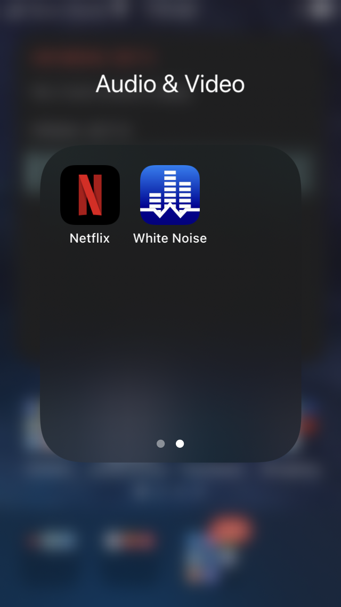

# List of apps for my iPhone
* Utilities
  * Bitwarden
  * IMDB
  * Google Maps
  * Google Drive
  * Time Calculator (Ha Thanh)
  * Alarmy (Delight Room Co., Ltd.)
  * Timer+ (Minima Software)
  * CVS
  * Chase
* Shopping
  * Amazon
  * Starbucks
  * Lowe's
  * Home Depot
  * Target
  * McDonald's
  * Ux Apps (Ultimatix)
* Anki
* Where is that?
* Ventra
* Microsoft Todo
* Allstate
* Numpad (ALPA AB)
* Oral-B
* Cash App
* iPrint&Scan
* myCigna
* xFinity My Account
* Remotes
  * Acrobat
  * Roku
  * Fire TV
  * August
* Communication
  * Facebook
  * Facebook Messenger
  * Outlook
  * LinkedIn
  * Teams
  * Reddit
  * Discord
* Audio & Video
  * Audible
  * Amazon Music
  * Prime Video
  * ListenBook Pro: bookplayer (Oleg Brailean)
  * Flacbox: FLAC Player Equalizer (Artem Meleshko)
  * Pocket Casts
  * YouTube
  * Udemy
  * UdemyBusiness
  * Netflix
  * White Noise (TMSOFT)

## Manual Install
### Visit https://www.ultimatix.net from your mobile and choose "Mobile Apps" from the menu
This will install Ux Apps
### Trust the Developer
Settings -> General -> VPN & Device Management -> Enterprise App
Select Tata Consultancy Services
Approve

* Ultimatix Authenticator
  * Timesheet

## Layouts
  \* The words Communicaiton, Audio and Video do not actually appear on iPhone screen. They do appear once menu is opened.

